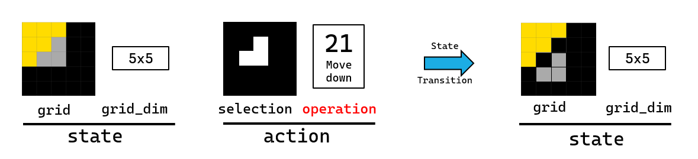

# ARCLE - ARC Learning Environment
ARCLE is a RL environment for training [Abstraction and Reasoning Corpus](https://github.com/fchollet/ARC) and ARC-like datasets, built on Farama [Gymnasium](https://github.com/Farama-Foundation/Gymnasium).

ARCLE implements several environments with various actions on editing grids of ARC, with **object-oriented grid operations**. Inspired by [O2ARC Interface](https://github.com/GIST-DSLab/O2ARC_V2), [O2ARC 3.0](https://o2arc.com) - the game-like human interface collecting human ARC solutions, ARCLE contains this interface as a RL environment, as well as the [testing interface](https://github.com/fchollet/ARC/tree/master/apps) given with ARC Dataset.

*Our work is presented at [CoLLAs 2024](https://lifelong-ml.cc/Conferences/2024)!* This paper contains initial experiments equipping ARCLE with PPO-optimized pixel-wise transformer on small grid pairs, in addition to a detailed description of ARCLE. Check out our [Paper](https://arxiv.org/abs/2407.20806).

Related Project - [Simon ARC Env](https://github.com/neoneye/simon-arc-env) (Dec 2023)

## Requirements
`Python >= 3.8`

## Installation
`pip install arcle`

[PyPI Project Page](https://pypi.org/project/arcle/)

## Available Environments

| Env Name| Description | Latest Version |
| --- | --- | --- |
| `RawARCEnv` | Environment with actions only coloring, resizing to answer grid, and submit operations  | v0 |
| `ARCEnv` | Implements browser-based testing interface of ARC, with coloring, flood-filling, copy and paste  | v0 |
| `O2ARCv2Env` | Implements [O2ARCv2 Interface](https://bit.ly/O2ARC-GIST), an extension of `ARCEnv` containing Move, Rotate, Flip, Crop, ... | v0 |

## Changelogs

#### 0.2.6
- Env Changes
    - **`O2ARCv2Env` is accessible via `O2ARCEnv` or `O2ARCEnv-v2`.**
    - Unify type of observations into `np.int8` (that were previously `np.uint8`)
    - Unify observation space into a dictionary of `Box` or `MultiBinary` to flatten observations properly by Gymnasium APIs
    - Remove over-conditioned (`@abstractmethod`) requirements of `AbstractARCEnv`. Now user must only override `create_operations` only.

- **Added action wrappers** (`BBoxWrapper`, `PointWrapper`) to change `selection` to bounding box selection or one-point selection.
- `Loader` now supports definable random number generator.
- Orginized examples

- Bug Fix
    - Fixed `terminated` is not emitted when `max_trial` is infinity (-1)

#### 0.2.5
- Python 3.8 Support (minimum requirement of Gymnasium)
- Env Changes
    - **Rename `ARCEnv` into `RawARCEnv` in this version.**
    - **Removed `MiniARCEnv`. Please use `RawARCEnv` with `loader=MiniARCLoader()` instead.**
    - **New `ARCEnv` added, consisting action space of ARC testing interface given along with the ARC Dataset.**
    - States in every environments are fully observable. All state-related instance variables are now in the `current_state` dictionary.
        - All operations receives `state` and `action`, and it changes `state` in-place.
        - You can deepcopy the state and call `env.transition(state_copied, action)` to get next state without changing original state on `O2ARCv2Env`. `env.transition` will be replaced as separated utility function in the future.
    - n-trial mode added. You canset maximum trials when you call `gym.make()` by putting argument `max_trial=num`. Unlimited trial mode is available when it is set by -1 (default).
    - Customizable `Submit` operation. It is defined in each env class as a method, not in a separated module.
        - You can specify boolean option `reset_on_submit` in `env.reset` (default=`False`)
    
- Bug fix
    - `FloodFill` operation without selection case fixed
    - `Paste` operation out-of-bound case fixed
    - `CopyI` operation out-of-bound case fixed
    - Apply patch exception handling

#### 0.2.2
- Bug fix
    - Default all-or-none reward now gives only when submitted. It affects to existing all environments.

#### 0.2.1
- O2ARCv2Env-v0
    - Changed `ResizeGrid` action to `CropGrid` action
    - Forced `FloodFill` action to select only one pixel (otherwise, it is NoOP)
    - Now `CopyI`, `CopyO`, `Paste` regards black pixels (pixel value 0) as a background. It copies pixels where the value is nonzero and the pixel is selected.
    - `action['selection']` can handle int (automatically casts into `np.bool_`)
- Several exceptions handling

#### 0.2.0
- ArcEnv-v0 & MiniArcEnv-v0 has renamed to ARCEnv-v0 & MiniARCEnv-v0.
- Changed internal `current_grid` variable to `grid` & `grid_dim`
- **Added O2ARCv2Env-v0 environment.**
- Added O2ARC Actions
    - Uses `selection` and `selected`. Some internal variables should be initialized.
    - Color, Flood Fill(DFS Color)
    - Move, Rotate, Flip
    - Copy, Paste and Clipboard Features (For O2ARC)

#### 0.1.1
- Change Images
- Fix minor issues

#### 0.1.0 
- Initial Build.
- **ArcEnv-v0 & MiniArcEnv-v0 Launched.**
